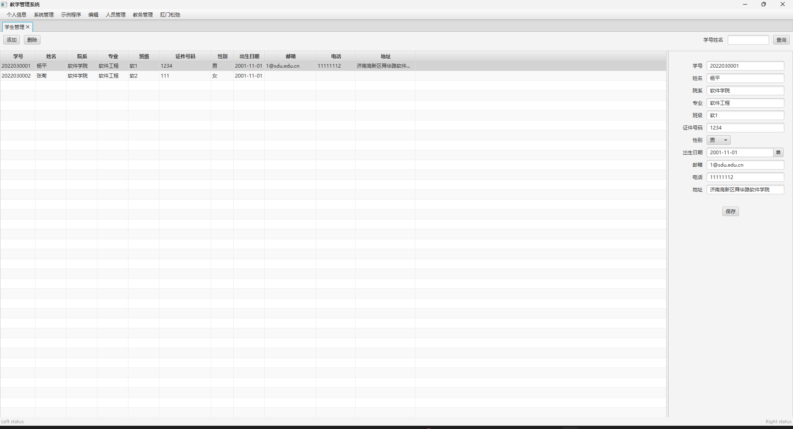
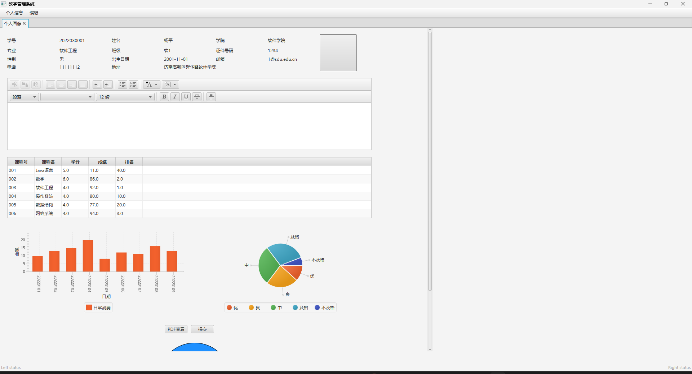

## 软件学院2022级高级程序开发题目及考核要求

**题目名称： 学生信息管理平台的设计与开发**

### l **目的**

锻炼学生使用高级程序设计语言进行面向对象的分析、设计和应用开发能力，结合JavaFX、Java IO流技术、数据库技术，网络技术、StringBoot等，利用开发框架实现一个综合性的应用系统。

### l **基本要求**

本次设计要求利用Java实现一个学生信息管理平台，是一个前后台分离的应用，前端基于Java FX 开发GUI图形交互界面，后端基于Java String Boot 开发，实现数据的操作与处理。

主要功能为：

**管理员权限**：

#### - 硬性规定

（1）学生基本信息、联系方式、入学前信息、家庭信息、社会关系等基本信息的管理

> - 学生的基本信息、联系方式已经在示例程序中被完成
>
> - 家庭信息：
>
>   - 后端创建附表，记录学生的家人的基本信息。
>
>   - 前端可能表格直接放不下，可以在表格上设置按键，点击后在右栏中显示并更改。
>
>     
>
> - ==新建&删除==：
>
>   - 个人信息与后续功能密切相关，在数据库层面应考虑外键的健壮性（如一删全删或者删除时弹窗警告or询问该学生的其他信息的处理方法）
>
> - 拓展搜索功能（模糊搜索），设计搜索逻辑和搜索后显示逻辑

> 可以加入**教师管理**功能，与课程信息联动

（2）学习信息管理，包括课程基本信息，课程中心（教材、课件、参考资料等）选课信息、考勤信息、作业信息、成绩信息等

> - 添加学习信息栏，这里涉及

（3）学生社会实践、学科竞赛、科技成果、培训讲座、创新项目、校外实习等创新实践信息管理

> 

（4）学生荣誉信息管理，包括获得的各种称号奖励等

> 

（5）学生体育活动、外出旅游、文艺演出、聚会、等日常活动管理。

> 

（6）学生外出请假信息和生活学习消费等日志信息管理

> 

（7）学生个人信息的统计汇入统计数据库

> 

（8）学生各种信息的查询统计、综合绩分的计算（可自行设计公式）和学生个人画像、个人简历的生成打印

> 

#### - 详细说明

##### + 个人信息

###### } 基本要求

1. **账号管理以及密码修改**
2. 呈现简化个人资料

###### } 拓展

1. 可以显示密码重置记录
2. 显示登录日志

##### + 人员管理

###### } 基本要求

- **学生管理**

1. 简而言之学生信息的增删查改))))

**增**: 注意增添格式检验等健壮性检测   **删**:可以在表中增加删除标记来隐藏以便于做到恢复功能 ) **查**: 根据学号 姓名 **改**: 格式检验等健壮性测试

2. 基本信息做好了,需增加家庭信息

家庭住址 家庭人数 父亲姓名 父亲职业 父亲年龄 父亲联系方式 母亲姓名 母亲职业 母亲年龄 母亲联系方式 其他成员关系及姓名

- **教师管理**

大体与学生管理差不多,其它细节稍加改动,如基本信息学号可以改成教师编号,查询时可根据 姓名 教师编号

1. 增加课程信息管理,包括不限于 课程编号 教师编号 上课教师 课程名称 上课地点 上课周 学分

###### } 拓展

???? ~~肛门松弛~~

##### + 教务管理

- **学习信息管理**

  - 课程管理

    与课程信息表管理,健壮性考虑,如添加进行检验,并弹出确认信息,查询可根据上课编号查询,教师编号查询教师所上的全部课程

    **} 拓展**

    可以做个课表

  - 成绩管理

    1. 表:学号 姓名 班级 课程号 课程名 学分 成绩  学年
    2. 根据 学号 姓名查询学生所有成绩,也可以输入班级查询班级学生的成绩,也可单独查询一科的成绩
    3. 绩点计算
    4. 打印

  - 作业管理

    ~~希腊奶,我也不知道作业有什么好管理的)))))~~

    教师 作业名称 班级 提交情况

  - 考勤管理
  
    大概是学生 课程 签到情况 谔谔你们往里填)注意健壮性 **注意与日志信息管理的学生请假管理联系**
  
- 创新实践管理

  社会实践 学科竞赛 科技成果 培训讲座 创新项目 校外实习 其他

- 日志信息管理

  - 学生外出请假信息管理

  学号
  请假人姓名
  请假缘由
  目的地
  联系方式
  返校时间
  是否销
  假辅导员意见

  - 消费记录

   消费类型 学生 学号 消费日期 消费金额

  可以做个统计功能

- 学生荣誉管理

学生 学号 学期 荣誉类型 荣誉名称

##### + 日常活动管理

一张表没什么好说的,数据类型包括-

体育活动 外出旅游 文艺演出 聚会 其他

**学生权限**

> 

（所谓信息管理就是信息的CRUD——添加、查询、修改，、删除）

### l 开发说明：

（1）数据的持久性存储，数据库管理系统，可使用sqlite文件行数据库进行数据的存储，基础数据库文件java.db已经为项目的开发提供的基础的表设计和测试数据。

（2）系统服务端程序基于String Boot的JPA技术进行开发，java-server工程已经为项目搭建了基础框架，主要实现了基于JPA的数据库访问、支持前端Http请求的Web服务、包括用户登录、角色管理、权限管理、菜单管理、数据字典管理等基础功能实现、提供了学生管理功能后台数据Web服务的示例代码，和包括图形上传下载，Excl上传下载，HTML页面，PDF文件等级实现，学生可根据需求设计相关数据库表，创建响应model,repository, control等类设计相关的属性和方法，完成Project的开发目的后端业务模块的编程实现。

（3）系统前端程序基于Java FX，JXML等 技术进行开发， javafxclient工程已经为项目前端程序搭建了基础框架，主要实现了登录界面、系统主框架界面，主框架包括菜单栏和基于标签页的工作空间的管理，可以实现选择菜单到功能面板到工作空间窗口的装载和切换，实现了前端程序与后端java-server程序进行数据通讯的实现，实现了基本的菜单管理、数据字典管理等基本数据管理，提供了学生基本信息维护功能和个人画像的参考实现，学生可在此开发框架的基础上，通过菜单管理功能或者手工添加代码增加菜单项、手工编辑或者通过可视化的设计工具SceneBuilder编辑设计一个描述功能面板的FXML文件，创建交互控制Controller类，实现一个项目前端功能开发，配合java-server后端业务的设计开发，完成整个项目的设计。

注：StudentControllerLocal、SQLiteJDBC 给出了前端直接采用JDBC技术实现数据增删改操作参考实现，项目完成也可以采用但不建议该模式开发，主要原因，StringBoot是目前最流行的Java后端开发技术，jdbc进行数据操作代码实现相对比较复杂。

（4）开发环境为IDEA

### l 开发团队要求

4-5人组队分工协作，课代表或班长第二周上报分组名单给授课老师。

### l **考核方式**

Java课程设计上机共8周，每周4小时，共32小时。计分方式：

1） 项目开发报告（20分）附录为项目开发报告要求，提交时间为小组系统验收后，第二天早8点为截止时间。与系统源代码一起打包上传FTP。每组一份。

2） 系统运行演示验收（标准分：80分），以组为单位检查，按照下述系统检查标准打分。

3） 每个组员依据开发过程的工作贡献确定个人的得分权值（小组自己讨论确定），系统检查的同时提交给老师。策略为：假设本组最终成绩总为90（系统运行+源代码+开发报告），五个小组成员完成，每个人的贡献比例为：1、1、1.2、0,9、0.9（总和必须为5）。则五个同学的得分为90、90、100（90*1.2=108，封顶取分100）、81、81。

4） 系统检查时间：本课程课内八周（第1-8周），实验上机八周（第3-10周）。小组可在第12周周五前任意时间提交（注：提交是一次性的，不可撤回），系统检查由助教进行，源代码与技术报告上传FTP。

***\*系统检查标准（80分）\****：

Ø 基本完成题目要求的全部功能，系统能够完成基本流程：40分（功能缺少酌情扣分）。 

Ø 从功能实现体现出数据库设计能力，比如实体-关系的灵活运用，跨表实现功能需求：20分（只完成系统最基本数据表设计10分）。

Ø 系统设计：20分（前端设计突破原有框架界面元素，有自己的独特性，系统切换运行流畅、无Bug出现。系统总体设计合理、规范性）。

   最终成绩总分组成： （系统检查+源代码）（80）+项目开发报告（20）

   百分制按照五级标准转换为：优、良、中、及格、不及格提交教务

 

### ***附录：项目开发报告模板***

***\*（A4页面，小四号宋体，1.5倍行距，word文档，不重篇幅长短重质量）\****

第一章 系统总体要求

1.系统总体功能要求

2.开发平台介绍

3.开发进度表

4.小组成员分工表及个人贡献比例

第二章 系统需求分析

   按照课程内关于“软件项目分析与设计基本过程”内容讲述的方法、步骤，运用UML图表，描述本系统的需求分析。

第三章 系统设计

   1.系统概要设计

   系统的总体架构、工作流程。功能模块划分等，运用UML图阐述设计结果

2.系统详细设计

实体关系图（UML类图），以及对类成员的数据描述和功能介绍

UML活动图、动态协作图等，主要描述具体业务功能的执行过程。

数据库结构，相应的数据库表，关联依赖等

第四章 系统实现

​	介绍系统实现的过程：

  实体类、控制逻辑、数据表维护查询等功能

每部分可以有界面截图、关键代码及注释阐述，主要技术难点等（不允许大量堆砌界面截图，堆砌代码，因为已经提交了源代码，这里只给出能阐述自己工作成就的关键片段，只是为了体现自己的思想）。

第五章 总结

 开发过程总结与体会

 

 